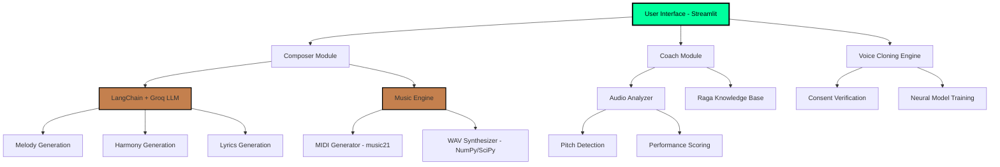

# 🎵 MACHINA.OS | AI Music Composer

> **Industrial-grade AI audio synthesis for Bollywood-inspired music generation, vocal analysis, and voice cloning**

[](https://www.python.org/downloads/)
[](https://streamlit.io)
[](https://opensource.org/licenses/MIT)
[](https://langchain.com)

---

## 📖 Overview

**MACHINA.OS** is an advanced AI-powered music composition system that combines Indian classical music theory (Ragas) with modern AI/ML techniques to generate, analyze, and synthesize Bollywood-style music. Built with a cyberpunk-industrial aesthetic, it features three core modules: **Composer**, **Diagnostics**, and **Voice Cloning**.

### 🎯 Problem Statement

Traditional music composition requires:
- Deep knowledge of music theory and Indian classical ragas
- Years of vocal training to evaluate singing accuracy
- Expensive studio equipment for voice synthesis
- Manual composition that is time-intensive

**MACHINA.OS** democratizes music creation by leveraging AI to automate composition, provide instant vocal feedback, and enable voice cloning—all through an intuitive web interface.

---

## ✨ Key Features

### 🎼 **01_COMPOSER** (AI Song Generation)
- **LLM-Powered Composition**: Uses Groq's LLaMA 3.1 for intelligent melody, harmony, and rhythm generation
- **Raga-Based System**: Authentic Indian classical music integration with knowledge of traditional scales
- **Multi-Format Output**: Generates MIDI files, synthesized WAV previews, and lyrical content
- **Real-time 3D Visualization**: Interactive Three.js reactor animation showing generation status

### 🔬 **02_DIAGNOSTICS** (Vocal Analysis)
- **Pitch Accuracy Detection**: Analyzes uploaded vocals against target ragas
- **Performance Scoring**: Multi-dimensional evaluation (pitch, timing, emotion, stability)
- **AI Singing Coach**: Provides constructive feedback using LangChain agents
- **Interactive Radar Charts**: Visual representation of vocal performance metrics

### 🧬 **03_CLONING_VAT** (Voice Synthesis)
- **Ethical Voice Cloning**: Requires explicit consent verification
- **Multi-Sample Training**: Learns from user-provided voice samples
- **Model Archival System**: Stores trained voice models for reuse
- **Security Protocol**: Built-in safeguards against unauthorized voice replication

---

## 🏗️ Architecture



### Data Flow
1. **Input Layer**: User provides prompts, audio files, or voice samples
2. **Processing Layer**: LLM generates musical data → Music engine synthesizes audio
3. **Analysis Layer**: Audio analyzer evaluates performance → Coach provides feedback
4. **Output Layer**: Returns MIDI, WAV, visualizations, or trained models

---

## 🛠️ Tech Stack

### **Core Framework**
- **Frontend**: Streamlit 1.28+ with custom CSS/JS (industrial theme)
- **3D Graphics**: Three.js (via HTML components)

### **AI/ML Stack**
- **LLM Provider**: [Groq](https://groq.com) (LLaMA 3.1-8B)
- **Orchestration**: LangChain 0.1+
- **Audio Processing**: NumPy, SciPy, Librosa

### **Music Generation**
- **Theory Engine**: music21 (MIT)
- **MIDI Synthesis**: music21.midi
- **WAV Synthesis**: Custom sawtooth wave generator
- **TTS**: gTTS (Google Text-to-Speech)

### **Data Visualization**
- **Charts**: Plotly (radar plots)
- **3D Rendering**: Three.js embedded components

### **Backend**
- **Language**: Python 3.8+
- **Environment**: python-dotenv for configuration

---

## 📁 Project Structure

```
AI_MUSIC_COMPOSER/
│
├── 📄 app.py                      # Main Streamlit application
├── 📄 main.py                     # Base MusicLLM class
├── 📄 composer.py                 # Bollywood song composer with JSON repair
├── 📄 music_engine.py             # MIDI/WAV generation engine
├── 📄 audio_analyzer.py           # Vocal analysis and pitch detection
├── 📄 coach.py                    # AI singing coach with feedback
├── 📄 voice_cloning.py            # Voice cloning with consent verification
├── 📄 raga_knowledge.py           # Indian classical raga database
├── 📄 prompt.py                   # LLM prompt templates
├── 📄 note_utils.py               # Musical note sanitization utilities
│
├── 📂 ui/
│   └── composer_3d.html           # Three.js 3D reactor visualization
│
├── 📂 generated_music/            # Output directory (auto-created)
├── 📂 venv/                       # Virtual environment
├── 📄 requirements.txt            # Python dependencies
├── 📄 .env                        # Environment variables (not in repo)
└── 📄 README.md                   # This file
```

---

## 🚀 Installation Guide

### Prerequisites
- Python 3.8 or higher
- pip package manager
- Groq API key ([Get one here](https://console.groq.com))

### Step 1: Clone the Repository
```bash
git clone https://github.com/yourusername/ai-music-composer.git
cd ai-music-composer
```

### Step 2: Create Virtual Environment
```bash
python -m venv venv

# Activate (Windows)
venv\Scripts\activate

# Activate (macOS/Linux)
source venv/bin/activate
```

### Step 3: Install Dependencies
```bash
pip install -r requirements.txt
```

### Step 4: Configure Environment Variables
Create a `.env` file in the project root:
```env
GROQ_API_KEY=your_groq_api_key_here
```

### Step 5: Run the Application
```bash
streamlit run app.py
```

The app will open in your browser at `http://localhost:8501`

---

## 📦 Requirements.txt

```txt
streamlit>=1.28.0
langchain>=0.1.0
langchain-groq>=0.0.1
langchain-core>=0.1.0
music21>=9.1.0
plotly>=5.18.0
python-dotenv>=1.0.0
scipy>=1.11.0
numpy>=1.24.0
gtts>=2.5.0
```

---

## 💻 Usage Examples

### Example 1: Generate a Bollywood Song
```python
# Via UI: Navigate to "01_COMPOSER" tab
# 1. Enter prompt: "Romantic ballad with sitar and tabla"
# 2. Select mood: "Ethereal"
# 3. Select raga: "Yaman"
# 4. Select voice: "Female"
# 5. Click "INITIATE_SEQUENCE"
# Output: MIDI file + WAV preview + Lyrics
```

### Example 2: Analyze Your Singing
```python
# Via UI: Navigate to "02_DIAGNOSTICS" tab
# 1. Upload your singing audio file (WAV/MP3)
# 2. Select the raga you attempted: "Bhairav"
# 3. Click "RUN_DIAGNOSTICS"
# Output: Radar chart with performance scores + AI feedback
```

### Example 3: Programmatic Usage
```python
from composer import BollywoodComposer
from music_engine import MusicEngine

composer = BollywoodComposer()
engine = MusicEngine()

song_data = composer.generate_full_song(
    user_input="Energetic dance track",
    mood="Aggressive",
    raga="Bhairavi",
    voice="Male"
)

midi_path, _ = engine.create_extended_midi(song_data)
wav_bytes = engine.generate_preview_wav(song_data)

print(f"Generated MIDI: {midi_path}")
print(f"Lyrics: {song_data.get('lyrics')}")
```

---

## ⚙️ Configuration & Environment Variables

| Variable | Description | Required | Default |
|----------|-------------|----------|---------|
| `GROQ_API_KEY` | API key for Groq LLM service | ✅ Yes | None |
| `STREAMLIT_THEME` | Custom theme (auto-injected) | ❌ No | Dark Industrial |
| `OUTPUT_DIR` | Directory for generated files | ❌ No | `generated_music/` |

### Advanced Configuration
You can modify LLM parameters in `composer.py`:
```python
self.llm = ChatGroq(
    temperature=0.5,  # Lower = more deterministic (0.0-1.0)
    model_name="llama-3.1-8b-instant"  # Or upgrade to larger models
)
```

---

## 🎨 Demo / Screenshots

### Main Interface
```
┌─────────────────────────────────────────────────────┐
│         M A C H I N A . O S                         │
│     // AUDIO_SYNTHESIS_UNIT_V4                      │
├─────────────────────────────────────────────────────┤
│  [01_COMPOSER] [02_DIAGNOSTICS] [03_CLONING_VAT]    │
├─────────────────────────────────────────────────────┤
│                                                     │
│  INPUT_PARAMETERS          3D REACTOR PANEL        │
│  ─────────────────        ┌──────────────────┐    │
│  CORE_DIRECTIVE            │  ⚡ GENERATING  │    │
│  Industrial techno...      │    [3D VISUAL]   │    │
│                            └──────────────────┘    │
│  ATMOSPHERE: [Dark ▼]                              │
│  SCALE_PROTOCOL: [Puriya ▼]     TRACK_ID: PUR-001 │
│                                  ROOT: C           │
│  [INITIATE_SEQUENCE]            🔊 [Audio Player] │
│                                                     │
│                            DATA_STREAM             │
│                            >> Bass drops at dawn   │
│                            >> Machines hum in sync │
└─────────────────────────────────────────────────────┘
```

### Vocal Analysis Radar Chart
```
        PITCH
          ★
     ╱         ╲
TIMING ★──────★ VIBE
     ╲         ╱
       ★──★──★
   STABILITY  RANGE
   
   Score: 87% - "Excellent swara accuracy!"
```

---

## 📊 Results / Output

### Generated Song Structure
```json
{
  "meta_emotion": "ETHEREAL_ROMANCE",
  "root_note": "C",
  "melody_main": ["C4", "D4", "E4", "G4", "A4"],
  "harmony": ["C4-E4-G4", "D4-F4-A4"],
  "rhythm": [1.0, 0.5, 0.5, 2.0],
  "lyrics": [
    "Machines sing in the night",
    "Electric dreams take flight"
  ],
  "full_lyrics_text": "Complete song lyrics..."
}
```

### Audio Specifications
- **Sample Rate**: 24,000 Hz
- **Bit Depth**: 16-bit PCM
- **Waveform**: Sawtooth (rich harmonic content)
- **Envelope**: ADSR (Attack-Decay-Sustain-Release)

---

## ⚠️ Limitations

### Current Constraints
1. **Audio Quality**: Synthesized audio uses basic waveforms (not full orchestration)
2. **LLM Hallucinations**: Occasionally generates invalid note names (handled by sanitization)
3. **Voice Cloning**: Requires 5+ minutes of clear audio for good results
4. **Raga Complexity**: Limited to predefined ragas in knowledge base
5. **Performance**: Heavy LLM calls can take 5-15 seconds per generation

### Known Issues
- **JSON Parsing**: LLM sometimes returns malformed JSON (auto-repair implemented)
- **Browser Compatibility**: 3D visualizations require WebGL support
- **File Size**: Large audio uploads may timeout on slower connections

---

## 🗺️ Future Enhancements / Roadmap

### Phase 1 (Q2 2025)
- [ ] Add real instrument samples (VST integration)
- [ ] Support for Western scales (major, minor, pentatonic)
- [ ] Export to MP3/FLAC formats
- [ ] Batch generation mode

### Phase 2 (Q3 2025)
- [ ] Fine-tune custom LLM on Indian classical music corpus
- [ ] Real-time audio streaming synthesis
- [ ] Collaborative composition (multi-user mode)
- [ ] Mobile app (React Native)

### Phase 3 (Q4 2025)
- [ ] Advanced voice cloning with emotion transfer
- [ ] Integration with DAW software (Ableton, FL Studio)
- [ ] Marketplace for sharing generated compositions
- [ ] API for third-party integrations

### Research Goals
- [ ] Implement Transformer-based music generation (MusicLM-style)
- [ ] Add style transfer between ragas
- [ ] Automatic chord progression generation with music theory constraints

---

## 🤝 Contributing Guidelines

We welcome contributions! Here's how you can help:

### Reporting Bugs
1. Check existing [Issues](https://github.com/yourusername/ai-music-composer/issues)
2. Create a new issue with:
   - Clear title
   - Steps to reproduce
   - Expected vs actual behavior
   - Screenshots/logs

### Submitting Pull Requests
1. Fork the repository
2. Create a feature branch: `git checkout -b feature/amazing-feature`
3. Make your changes
4. Add tests (if applicable)
5. Commit: `git commit -m "Add amazing feature"`
6. Push: `git push origin feature/amazing-feature`
7. Open a Pull Request

### Code Style
- Follow PEP 8 for Python code
- Use type hints where possible
- Add docstrings to all functions
- Keep lines under 100 characters

### Testing Checklist
```bash
# Run before submitting PR
python -m pytest tests/
python -m black .
python -m flake8 .
```

---

## 📄 License

This project is licensed under the **MIT License** - see the [LICENSE](LICENSE) file for details.

```
MIT License

Copyright (c) 2025 [Your Name]

Permission is hereby granted, free of charge, to any person obtaining a copy
of this software and associated documentation files (the "Software"), to deal
in the Software without restriction, including without limitation the rights
to use, copy, modify, merge, publish, distribute, sublicense, and/or sell
copies of the Software...
```

---

## 👥 Author / Credits

### Created By
**[Your Name]** - *Lead Developer & AI Engineer*  
[](https://github.com/yourusername)
[](https://linkedin.com/in/yourprofile)
[](mailto:your.email@example.com)

### Acknowledgments
- **Groq** for lightning-fast LLM inference
- **LangChain** for orchestration framework
- **music21** (MIT) for music theory toolkit
- **Streamlit** for rapid UI development
- Indian classical music community for raga knowledge

### Special Thanks
- Dr. [Music Theory Advisor Name] for raga accuracy validation
- Beta testers from [Community Name]
- Open-source contributors

---

## 📞 Support & Community

### Get Help
- 📖 [Documentation](https://github.com/yourusername/ai-music-composer/wiki)
- 💬 [Discord Community](https://discord.gg/yourserver)
- 🐛 [Report Bug](https://github.com/yourusername/ai-music-composer/issues/new?template=bug_report.md)
- 💡 [Request Feature](https://github.com/yourusername/ai-music-composer/issues/new?template=feature_request.md)

### Stay Updated
- ⭐ Star this repo to show support
- 👀 Watch for updates
- 🔔 Follow for release notifications

---

## 🙏 Citation

If you use this project in academic research, please cite:

```bibtex
@software{machina_os_2025,
  author = {Your Name},
  title = {MACHINA.OS: AI-Powered Bollywood Music Composer},
  year = {2025},
  url = {https://github.com/yourusername/ai-music-composer}
}
```

---

<div align="center">

**Built with ⚡ by AI Enthusiasts | Powered by 🎵 Music Theory**

[⬆ Back to Top](#-machinaos--ai-music-composer)

</div>
